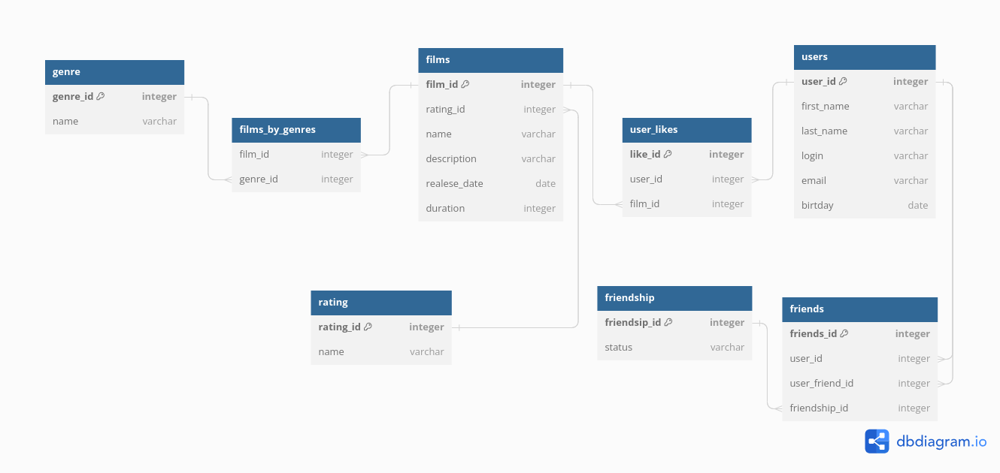

# java-filmorate(*оценка фильма*)


Данная программа представляет собой бэкенд для сервиса, который работает с фильмами и оценками пользователей, 
а также возвращает топ-5 фильмов, рекомендованных к просмотру.

---

### Поддержка следующих методов:

**PUT /users/{id}/friends/{friendId}** — добавление в друзья.

**DELETE /users/{id}/friends/{friendId}** — удаление из друзей.

**GET /users/{id}/friends** — возвращаем список пользователей, являющихся его друзьями.

**GET /users/{id}/friends/common/{otherId}** — список друзей, общих с другим пользователем.

**PUT /films/{id}/like/{userId}** — пользователь ставит лайк фильму.

**DELETE /films/{id}/like/{userId}** — пользователь удаляет лайк.

**GET /films/popular?count={count}** — возвращает список из первых count фильмов по количеству лайков. Если значение параметра count не задано, верните первые 10.

### Схема БД:


### Код для запросов:
1. Запрос друзей для определённого user с отображением статуса friendsgip (подтверждён/не подтверждён).
``` sql
SELECT
uf.first_name,
uf.last_name,
fr.status
FROM user AS u
INNER JOIN friends AS f ON u.user_id = f.user_id
INNER JOIN user AS uf ON f.user_friend_id = uf.user_id
INNER JOIN friendship AS fr ON f.friendship_id = fr.friendship_id
WHERE
u.user_id = 1 

```
***
2. Количество поставленных лайков.
```
SELECT
f.name,
COUNT(ul.like_id)
FROM film AS f
INNER JOIN user_likes AS ul ON f.film_id = ul.film_id
GROUP BY
f.name
```
***
3. Рейтинг фильмов.
```
SELECT
f.name,
g.name,
r.name
FROM film AS f
INNER JOIN film_by_genres AS fg ON f.film_id = fg.film_id
INNER JOIN rating AS r ON f.rating_id = r.rating_id
INNER JOIN genre AS g ON fg.genre_id = g.genre_id
GROUP BY
f.name
```
***
4. Топ 5 фильмов
```
SELECT
f.name,
COUNT(ul.like_id)
FROM film AS f
INNER JOIN user_likes AS ul ON f.film_id = ul.film_id
GROUP BY
f.name
ORDER BY
COUNT(ul.like_id) DESC
LIMIT 5;
```